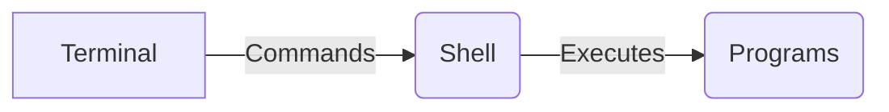

---
tags:
  - linux
  - macos
date: 2025-02-13
---
# Overview
The goal of this how-to guide is to give a quick introduction and explainer on how to use the terminal.

By the end of this guide you should be comfortable:
- opening a terminal window,
- submitting basic commands to navigate your system,
- viewing information about files and folders,
- executing scripts and programs.

This guide serves as a foundation for other how-to guides where I assume you are familiar with the information and concepts in this document. There are many other resources online you can use to delve into these topics in more detail.
# Assumptions
- You are on MacOS (or Linux).
- You are able to find the analogous steps on Linux yourself.
# Prerequisites
- A basic understanding of what a program is.
- A basic understanding of the file system of a computer.
- You have a backup of your system & data.
# A quick primer on terminology
A **terminal** is an application used to submit **commands** from the **command line** to a **shell** which interprets these commands to execute **programs** on a system. The output of any executed program is then sent back to the shell, which in turn sends it to the terminal window to be displayed to the user.



Examples of shells:
- sh
- bash
- zsh

> [!INFO] You may have heard the term console.
> A console is often just a physical terminal. You can assume they are synonymous.

Throughout this guide, I will simply refer to the above tools as "using the terminal". Commands will assume a `zsh` shell as it is the default on MacOS at the time of writing.
# Opening the terminal
On MacOS, use `Command + Space` to open Spotlight Search and type `Terminal`. It should auto-highlight the `Terminal.app` application which you can launch by pressing enter.

Alternatively, you can use Finder, right click on a folder (directory), and select `New Terminal at Folder`. This option will be at the bottom of the context menu. This will open a new terminal window with the directory you selected as the current working directory.
# Navigating the system
> [!INFO] The filesystem is a tree structure with the root at `/`.
> On MacOS and Linux systems, the filesystem does not have a `C://` drive. Instead, the file system is rooted at `/` and other file systems are mounted onto this tree at mount points. For example, your external media may be mounted at `/media/cdrom`.
> 
> How to mount filesystems is out of scope of this document.
## Where am I?
To show the current folder (directory), you can use the "print working directory" command.
```shell
pwd
```
This will show the full path to the current working directory.
## What files and folders are in this directory?
To show what files and folders are in a directory, you can list the directory contents, using the `ls` command. 
```shell
ls
```
For a more detailed view, you can list all entries in the long format. To do this, pass the `ls` command the optional flags `-a` for all entries and `-l` for long format. Written together as `-al` below.
```shell
ls -al
```
### Understanding the output of `ls -al`
The long format produces output that looks something like:
```text
drwxr-xr-x   3 liamtbrand  staff   96 13 Feb 14:59 .
drwxr-xr-x  17 liamtbrand  staff  544 13 Feb 14:59 ..
-rw-r--r--   1 liamtbrand  staff    0 13 Feb 14:59 file
drwxr-xr-x   2 liamtbrand  staff   64 13 Feb 14:59 directory
```
- The first line indicates the current directory. This is the directory you are in.
- The second line indicates the parent directory. This is the directory that contains this directory.
- The third line indicates a file in the current directory.
- The fourth line indicates a directory in the current directory.

The letters on the right hand side indicate a directory or file with a `d` or `-` in the first position.

The following 9 characters indicate the `r` read, `w` write and `x` executable bits for the owner's `user`, `group` and `everyone`. The bits are set to the letter when true, and `-` when false.

The `user` and `group` of each entry is also specified. In the above output that is `liamtbrand` as the `user` and `staff` as the `group`.

For example, the file `file` is owned by `liamtbrand` and group `staff`. `liamtbrand` has `r` read and `w` write permissions on the file as indicated by `rw-` in the first triplet. `staff` only has `r` read permissions on the file as indicated by `r--` in the second triplet. And `everyone` else only has `r` read permissions as indicated by the third triplet `r--`.

The `x` executable permission on directories indicates the permission to list the contents.
## Change directory
To change directory, use the `cd` command.
```shell
cd foldername
```
The above command will change your current working directory to the directory `foldername`. Substitute the name of the directory you want to change to here.
> [!INFO] Current and parent directories.
> The current directory is denoted by `.`
> The parent directory is denoted by `..`

This means, to change to the parent directory, use:
```shell
cd ..
```

## Change to the home directory
You can change the current working directory to your users home directory using:
```shell
cd ~
```
The `~` is a shortcut for the user's home directory and will be expanded by the shell.

# Inspecting a file
You can inspect the contents of a file using `cat`.
```shell
cat file
```
This will read the contents of the file `file` in the current working directory and output it to the terminal window.
# Executing a program
Say you have a program or script you want to execute. To execute a file in the directory you're currently in, you can do:
```shell
./script.sh
```
Where script is the name of your script, and by convention the name contains a `.sh` file type indicating that the file is of type `sh` script. When listing directory entries using `ls -al`, you will see what files can be executed by taking note of the `x` attribute on the right hand side.

To execute an installed program, simply type its name. An example of this would be starting a Minecraft server. First you type the name of the program followed by the arguments you want to pass to it. E.g: `java -jar server.jar` This would tell java to run the jar file `server.jar`.
# Getting help
You can get help on using a command quickly by opening the `man pages` for the command. For example:
```shell
man ls
```
This will open up the manual page for the `ls` command. You can substitute `ls` here with any other command on the system.

To search the man page quickly, type `/query` substituting `query` with the string you want to search for. Press `enter`, and then press `n` a few times to jump around the man page to each match of the search term.

Press `q` to quit the manual and return to the command line.

For further help, search engines are your friends. There are plenty of resources online.
# Installing a package manager
A package manager will help you download and install programs and their dependencies with ease. I use Homebrew on MacOS.

Install Homebrew following the instructions at: https://brew.sh.

# Managing multiple virtual terminals
If you want to use multiple virtual terminal windows or have the ability to detach and reattach to a terminal session, use `tmux`.

You can set `Terminal.app` to automatically execute a command on startup. I have mine execute `tmux attach`. This means that whenever I have a `tmux` session open and I accidentally close the window, reopening `Terminal.app` will reopen the existing session.

If you're using a package manager like `brew` you can run `brew install tmux` to install `tmux`.

# Customising the shell
You can create custom configuration including aliases by editing the `.zshrc` file for the `zsh` shell. An example of customisation would be to set aliases for common tasks. For example, I use Neovim as my editor and so I have `v` bound to it using the line `alias v="nvim"` in my `.zshrc`.

# Glossary
| Term         | Description                                                                                                                                   |
| ------------ | --------------------------------------------------------------------------------------------------------------------------------------------- |
| Directory    | A folder                                                                                                                                      |
| Terminal     | A program to show shell/program output and pass in input.                                                                                     |
| Shell        | A program to interpret commands.                                                                                                              |
| Command Line | The line in the terminal window where you type commands.                                                                                      |
| Executable   | A program on your system. Executables are invoked by the shell when the user types commands on the command line within their terminal window. |


